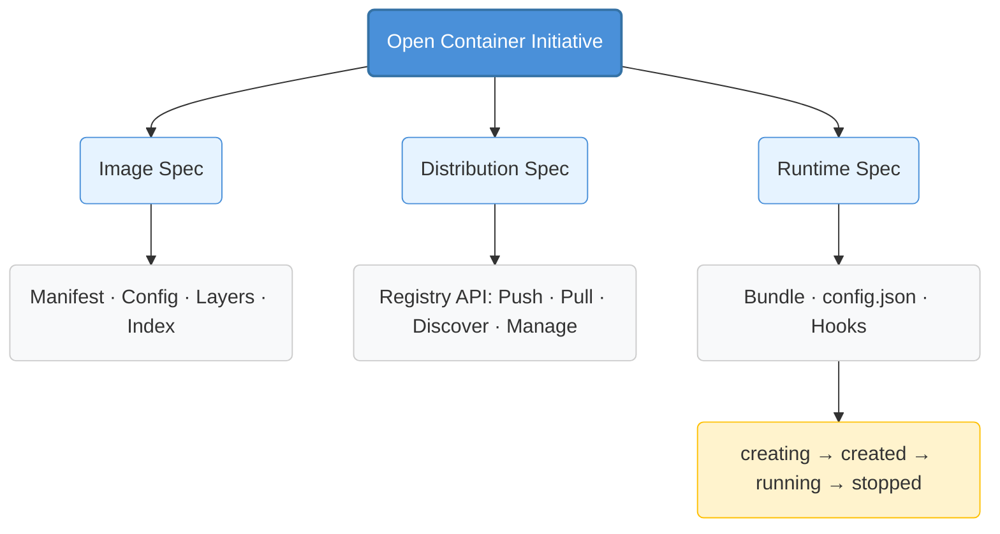

+++
title = "Understanding OCI (The Open Container Initiative)"
date = 2026-05-29T00:15:49Z
draft = false

# Optional fields
# summary = ""
tags = ["oci", "container", "cloud"]
categories = ["tech"]
# featured_image = ""
+++

## What Is OCI?

The **Open Container Initiative (OCI)** is a Linux Foundation project launched in June 2015 by Docker, CoreOS, and other container industry leaders. Its mission is to create open industry standards around container formats and runtimes.

OCI governs three core specifications:

| Specification | Purpose | Version |
|---|---|---|
| **Runtime Specification (runtime-spec)** | How to run a container from a filesystem bundle | 1.2 |
| **Image Specification (image-spec)** | How to package and ship container images | 1.1 |
| **Distribution Specification (distribution-spec)** | How to push/pull images to/from a registry | 1.1 |

These three specs define the complete lifecycle of a container: **build → ship → run**.

<!--more-->

---

## Why OCI? — The Problem It Solves

Before OCI, the container ecosystem was fragmented. Docker had its own image format and runtime, rkt had another, and there was no guarantee that an image built by one tool would work with another runtime. This killed portability and locked users into specific vendors.

**OCI was created to ensure that any OCI-compliant image can run on any OCI-compliant runtime**, period. It decouples the "what you build" from the "how you run it," enabling a pluggable ecosystem where tools like BuildKit, Kaniko, Podman, containerd, CRI-O, and others can interoperate freely.

---

## How OCI Works — Architecture Deep Dive

### 1. Image Specification — The Packaging Standard

An OCI image is a **content-addressable** graph of blobs and JSON descriptors. Its structure:

```
oci-image/
├── blobs/
│   └── sha256/
│       ├── <config-digest>        # Image configuration (JSON)
│       ├── <manifest-digest>      # Image manifest (JSON)
│       ├── <layer-digest-1>       # Filesystem layer (tar.gz)
│       ├── <layer-digest-2>       # Filesystem layer (tar.gz)
│       └── ...
└── index.json                      # Optional multi-architecture index
```

**Key components:**

- **Manifest** — Lists the config blob and layer blobs with their digest and media type. It's the "table of contents" of the image.
- **Configuration** — Contains metadata like environment variables, entrypoint, command, working directory, exposed ports, volumes, and the history of layers.
- **Layers** — Each layer is a filesystem diff (a tar archive). Layers are stacked on top of each other to form the final root filesystem using an overlay filesystem.
- **Image Index (optional)** — Points to multiple manifests for different platforms (`linux/amd64`, `linux/arm64`, etc.), enabling multi-arch images.

Every blob is addressable by its **SHA-256 digest**, making the entire image tamper-evident and immutable.

### 2. Distribution Specification — Registry API

The distribution spec standardizes how images move between machines. The core operations:

```
Pull (GET /v2/<name>/manifests/<ref>)
  ├── Fetch manifest
  └── For each layer in manifest:
        Fetch blob (GET /v2/<name>/blobs/<digest>)

Push (upload layers first, then manifest)
  ├── POST /v2/<name>/blobs/uploads/              (initiate upload)
  ├── PATCH /v2/<name>/blobs/uploads/<session>    (upload chunk)
  ├── PUT /v2/<name>/blobs/uploads/<session>?digest=<sha256>  (complete blob)
  └── PUT /v2/<name>/manifests/<tag>              (upload manifest)
```

Every registry (Docker Hub, Quay, GHCR, Harbor, etc.) implements this API, meaning any OCI-compliant client can push/pull from any OCI-compliant registry.

### 3. Runtime Specification — Running a Container

A runtime bundle is just a directory on disk:

```
bundle/
├── config.json           # Container configuration
└── rootfs/               # Root filesystem (unpacked from layers)
```

**`config.json`** defines everything about the container: its process (command, args, env, cwd), Linux namespaces, cgroups, mounts, capabilities, seccomp, SELinux, rlimits, hooks, and more.

#### Container Lifecycle

The runtime lifecycle defines four states:

```
creating → created → running → stopped
```

| State | Description |
|---|---|
| **creating** | Runtime creates the container environment (namespaces, cgroups, rootfs). Hooks: `createRuntime` → `createContainer`. |
| **created** | Container environment is ready; the user program has not started yet. |
| **running** | The user program is executing inside the isolated environment. Hooks: `startContainer` → (program runs) → `poststart`. |
| **stopped** | The process has exited or was killed. Cleanup is performed by the `delete` operation. Hooks (on delete): `poststop`. |

**`runc`** is the reference implementation of the OCI runtime spec — a simple CLI tool that wraps Linux kernel primitives (namespaces, cgroups, overlay filesystems, seccomp) to spawn and manage containers.

---

## How Container Orchestration Works on Top of OCI

Higher-level systems like Kubernetes, Docker Compose, and Nomad sit **above** OCI runtimes. The stack looks like this:

```
┌──────────────────────────────────────┐
│          Orchestration               │
│  (Kubernetes, Swarm, Nomad)          │
├──────────────────────────────────────┤
│       Container Engine / Shim        │
│  (containerd, CRI-O, Docker Engine)  │
├──────────────────────────────────────┤
│    OCI Runtime (runc, crun, youki)   │
├──────────────────────────────────────┤
│         OS Kernel (Linux)            │
│  (namespaces, cgroups, overlayfs)    │
└──────────────────────────────────────┘
```

**How orchestration maps to OCI:**

1. **Kubernetes CRI** — The Container Runtime Interface (CRI) is a plugin interface that lets kubelet use any container runtime. containerd and CRI-O implement CRI, and they internally use OCI runtimes (runc) to actually run containers.

2. **Image Pull Flow** — When Kubernetes schedules a pod, kubelet tells containerd/CRI-O to pull the image. The engine uses **OCI Distribution Spec** to fetch the manifest and layers from the registry, then expands them into an **OCI Runtime Bundle**.

3. **Pod Sandbox** — In Kubernetes, pause containers create the pod's namespace sandbox first, then application containers join that sandbox — all managed through OCI runtimes.

4. **Network & Storage** — CNI (Container Network Interface) and CSI (Container Storage Interface) handle networking and storage respectively, but they ultimately work with the namespaces and mounts configured by the OCI runtime.

---

## When to Use OCI — Application Scenarios

| Scenario | Why OCI Matters |
|---|---|
| **Multi-cloud / hybrid cloud** | OCI images run identically on any Kubernetes cluster, anywhere. No vendor lock-in. |
| **CI/CD pipelines** | Build once with any OCI-compliant builder (Docker, Podman, BuildKit, Kaniko), ship to any OCI registry, deploy anywhere. |
| **Edge computing** | Lightweight runtimes like `crun` (C-based) or `youki` (Rust-based) can run OCI images on resource-constrained devices. |
| **Secure / air-gapped environments** | OCI distribution spec allows running private registries (Harbor, Nexus) behind firewalls. Content-addressability ensures integrity. |
| **Multi-architecture deployment** | OCI Image Index lets you build one manifest for `linux/amd64`, `linux/arm64`, `windows/amd64` — the runtime fetches the right variant. |
| **Confidential computing** | OCI runtime can be extended with trusted execution environments (TEEs) like Intel SGX or AMD SEV, without changing the image format. |
| **Artifact distribution** | OCI distribution spec is generic enough to distribute non-container artifacts (SBOMs, signatures, Helm charts, WASM modules) using the same registry infrastructure. |

---

## What We Have Learned as an Architect — OCI Design Principles

OCI is not just a specification — it is a case study in good systems architecture. Here are the key design principles we can learn from:

| Principle | How OCI Applies It |
|---|---|
| **Minimal Interface Contract** | Each spec defines the smallest possible surface area. The runtime spec only cares about a `config.json` + `rootfs` on disk. It does not dictate how images are built or pulled. This minimizes coupling. |
| **Separation of Concerns** | Image, Distribution, and Runtime are three independent specs owned by separate OCI sub-projects. A runtime author never needs to understand the distribution API, and vice versa. |
| **Content-Addressability** | Every blob is identified by its SHA-256 digest. This gives you immutability, deduplication, and tamper evidence for free. It is the same principle powering Git, IPFS, and CAS (Content-Addressable Storage) systems. |
| **Layered Composability** | Filesystem layers are independent diffs that stack. This enables caching, sharing base layers across images, and incremental builds — exactly the same strategy used in version control and build systems. |
| **Interface, Not Implementation** | OCI specifies *what*, not *how*. Anyone can write a runtime (`runc`, `crun`, `youki`), a builder (`Docker`, `BuildKit`, `Kaniko`), or a registry (`Docker Hub`, `Harbor`, `GHCR`) as long as they implement the spec. This is textbook interface-based design. |
| **Versioned Backward Compatibility** | Each spec version is stable and backward-compatible. OCI 1.0 images still work with 1.x runtimes. This allows the ecosystem to evolve without breaking consumers. |
| **Pluggable Ecosystem** | Because each layer is standardized, you can mix and match: use BuildKit to build, Harbor to store, containerd to pull, and crun to run — all OCI-compliant, all interoperable. |

As architects, the takeaway is clear: **define narrow, stable interfaces at layer boundaries; let the ecosystem innovate independently within each layer.**

---

## Practical Example: Pull, Inspect, and Run an OCI Image from Scratch

This example walks through the full OCI lifecycle using `skopeo`, `umoci`, and `runc` — without Docker.

### Prerequisites

```bash
# Install tools (Ubuntu/Debian)
sudo apt install skopeo runc
go install github.com/opencontainers/umoci/cmd/umoci@latest
```

### Step 1 — Pull an Image as OCI Layout

```bash
mkdir -p oci-demo && cd oci-demo

# Pull alpine image into OCI layout format
skopeo copy docker://alpine:latest oci:alpine-oci:latest
```

This creates an `oci-layout` file, a `blobs/` directory with the content-addressed manifests and layers, and an `index.json`.

### Step 2 — Inspect the OCI Layout

```bash
# List blobs
tree blobs/
```

You will see something like:

```
blobs/sha256/
├── <config-sha256>       # ~1KB — JSON config (env, entrypoint, etc.)
├── <manifest-sha256>     # ~500B — manifest listing layers
└── <layer-sha256>        # ~3MB — gzipped tar of root filesystem
```

```bash
# Read the manifest
jq . blobs/sha256/<manifest-sha256>
```

The manifest reveals the config digest, layer digests, and media types — the "table of contents" of the image.

### Step 3 — Unpack into an OCI Runtime Bundle

```bash
# Unpack the OCI image into a runtime bundle
sudo umoci unpack --image alpine-oci:latest bundle/
```

The `bundle/` directory now contains:

```
bundle/
├── config.json            # OCI runtime configuration
└── rootfs/                # Unpacked Alpine root filesystem
    ├── bin/
    ├── etc/
    ├── lib/
    └── ...
```

### Step 4 — Run the Container with runc

```bash
# Run a command in the container
sudo runc run --bundle bundle/ alpine-container
```

This spawns a shell inside the container using Linux namespaces, cgroups, and the rootfs from the OCI bundle. You are now running an OCI container directly through the reference runtime — no Docker daemon involved.

```bash
# Inside the container
cat /etc/os-release
# Alpine Linux 3.x
exit
```

### Step 5 — Clean Up

```bash
sudo runc delete alpine-container
```

### What Just Happened

1. **Image Spec** — Alpine was pulled as a content-addressed OCI layout (manifest + config + layers)
2. **Distribution Spec** — `skopeo` used the distribution API to pull the image from Docker Hub
3. **Runtime Spec** — `umoci` unpacked layers into a bundle; `runc` consumed the bundle and ran the container using kernel primitives

No Docker, no containerd — just raw OCI components. This is the foundation every container tool is built on.

## Summary


OCI solved the container standardization problem by defining clear, minimal interfaces between image format, distribution, and runtime. This modular architecture allows the ecosystem to innovate independently at each layer while maintaining full interoperability — the same image that runs on your laptop with Docker runs on a production Kubernetes cluster with containerd and a million-edge-node fleet with crun.

---

## References

- [Open Container Initiative (OCI) — Official Site](https://opencontainers.org/)
- [OCI Runtime Specification (runtime-spec)](https://github.com/opencontainers/runtime-spec)
- [OCI Image Specification (image-spec)](https://github.com/opencontainers/image-spec)
- [OCI Distribution Specification (distribution-spec)](https://github.com/opencontainers/distribution-spec)
- [runc — Reference OCI Runtime Implementation](https://github.com/opencontainers/runc)
- [umoci — OCI Image Tool](https://github.com/opencontainers/umoci)
- [skopeo — Inspect and Transfer Container Images](https://github.com/containers/skopeo)
- [containerd — Industrial-Grade Container Runtime](https://containerd.io/)
- [CRI-O — Lightweight CRI Runtime for Kubernetes](https://cri-o.io/)
