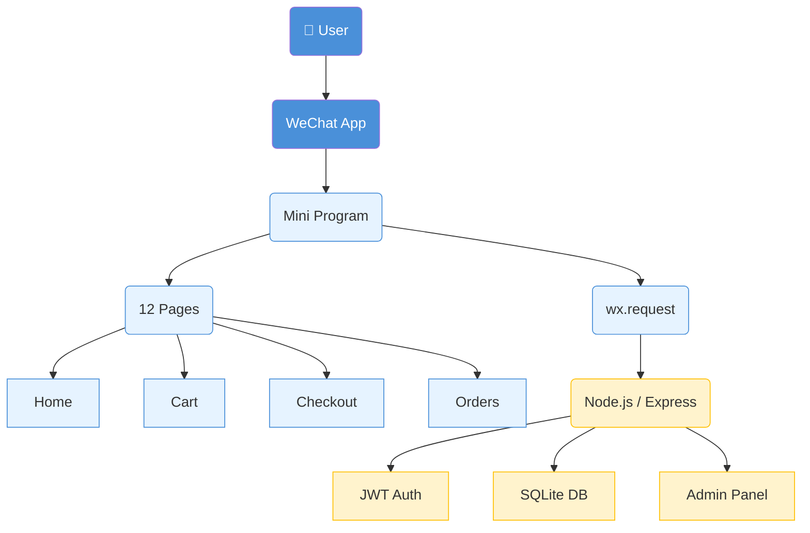

+++
title = "Introduction to WeChat Mini Program Development"
date = 2026-06-15T00:00:00Z
draft = true

# Optional fields
summary = "A comprehensive guide to building WeChat Mini Programs, from project structure to production deployment, using a complete e-commerce solution as a practical example."
tags = ["wechat", "mini-program", "javascript", "nodejs", "ecommerce", "mobile-development"]
categories = ["tech"]
# featured_image = ""
+++

## What Is a WeChat Mini Program?

A **WeChat Mini Program** (小程序) is a lightweight application that runs inside the WeChat ecosystem. Unlike native mobile apps, users don't need to download them from an app store — they can be accessed instantly by scanning a QR code, searching within WeChat, or clicking a shared link.

Think of it as a hybrid between a website and a native app: it provides a native-like user experience with near-instant loading, but without the friction of installation. With over 1 billion monthly active users on WeChat, mini programs have become a dominant force in China's mobile ecosystem.

<!--more-->

---

## Why Build a Mini Program?

| Advantage | Description |
|---|---|
| **Zero Installation** | Users access instantly via QR code or search |
| **Native Experience** | Smooth animations, gestures, and hardware access |
| **Built-in Ecosystem** | WeChat Pay, login, sharing, and social features |
| **Lower Development Cost** | One codebase, cross-platform (iOS + Android) |
| **Easy Distribution** | Share via chat, moments, or QR codes |

Mini programs are ideal for e-commerce, booking systems, content delivery, tools, and services that benefit from quick access without full app installation.

---

## Mini Program Architecture Overview

A WeChat Mini Program follows a structure similar to web development but with its own framework:

```
mini-program/
├── app.js          # App lifecycle and global logic
├── app.json        # App configuration (pages, windows, tabBar)
├── app.wxss        # Global styles
└── pages/          # Individual pages
    ├── index/
    │   ├── index.js
    │   ├── index.json
    │   ├── index.wxml
    │   └── index.wxss
    └── ...
```

### Key Concepts

- **WXML (WeiXin Markup Language)** — Similar to HTML, defines the page structure with WeChat-specific components
- **WXSS (WeiXin Style Sheets)** — Extended CSS with responsive `rpx` units and scoped styles
- **Page Logic (JS)** — Handles data binding, lifecycle events, and API calls
- **App Configuration** — Defines routes, window appearance, bottom tab bar, and permissions

---

## A Real-World Example: E-Commerce Mini Program

To demonstrate the full development lifecycle, I've built a complete e-commerce solution with a WeChat Mini Program frontend and a Node.js backend. You can find the full source code at [github.com/woojar/mp](https://github.com/woojar/mp).

### Project Structure

```
mp/
├── wechat-backend/           # REST API Server
│   ├── server.js            # Express server
│   ├── admin.js             # Admin dashboard & API
│   ├── database.js          # SQLite operations
│   └── __tests__/           # 46 backend tests
│
└── wechat-frontend/         # WeChat Mini Program
    ├── app.js               # App entry point
    ├── app.json             # App configuration
    ├── config.js            # Environment-specific config
    ├── pages/               # 12 pages
    └── utils/               # Utilities (i18n, etc.)
```

### Tech Stack

| Layer | Technology |
|---|---|
| Frontend | WeChat Mini Program (WXML, WXSS, JS) |
| Backend | Node.js, Express.js |
| Database | SQLite (sql.js) |
| Auth | JWT |
| Testing | Jest, Supertest |

> **Note:** The backend defaults to port `3000`, but you can set the `PORT` environment variable to match your frontend config (e.g., `3030` for production).

---

## Frontend: Building the Mini Program Pages

The e-commerce project includes 12 pages covering the complete shopping flow:

| Page | Description |
|---|---|
| Home | Categories, product list, and banners |
| Product | Detail page with images and description |
| Cart | Shopping cart with quantity management |
| Checkout | Address selection and order review |
| To-Pay | Order payment flow |
| Orders | Order history and status tracking |
| Order Detail | Single order view with actions |
| User | Profile with settings |
| Favorites | Saved products |
| Address List | View saved addresses |
| Address Edit | Add or edit an address |
| Search | Product search functionality |

### Page Structure

Each page in a WeChat Mini Program consists of four files:

**`app.json`** — Register all pages:
```json
{
  "pages": [
    "pages/index/index",
    "pages/product/product",
    "pages/cart/cart",
    "pages/checkout/checkout",
    "pages/orders/orders"
  ],
  "window": {
    "navigationBarTitleText": "Woojar Store",
    "navigationBarBackgroundColor": "#ffffff"
  },
  "tabBar": {
    "list": [
      { "pagePath": "pages/index/index", "text": "Home" },
      { "pagePath": "pages/cart/cart", "text": "Cart" },
      { "pagePath": "pages/user/user", "text": "Profile" }
    ]
  }
}
```

**`index.wxml`** — Page template:
```xml
<view class="container">
  <swiper class="banner" autoplay="{{true}}" circular="{{true}}">
    <swiper-item wx:for="{{banners}}" wx:key="id">
      <image src="{{item.imageUrl}}" mode="aspectFill" />
    </swiper-item>
  </swiper>
  
  <view class="product-list">
    <view class="product-item" wx:for="{{products}}" wx:key="id" bindtap="onProductTap" data-id="{{item.id}}">
      <image src="{{item.mainImage}}" mode="aspectFill" />
      <text class="product-name">{{item.name}}</text>
      <text class="product-price">¥{{item.price}}</text>
    </view>
  </view>
</view>
```

**`index.js`** — Page logic:
```javascript
const app = getApp();

Page({
  data: {
    banners: [],
    products: []
  },

  onLoad() {
    this.loadBanners();
    this.loadProducts();
  },

  async loadBanners() {
    const res = await app.request('/banners');
    this.setData({ banners: res.data });
  },

  async loadProducts() {
    const res = await app.request('/products');
    this.setData({ products: res.data });
  },

  onProductTap(e) {
    const id = e.currentTarget.dataset.id;
    wx.navigateTo({ url: `/pages/product/product?id=${id}` });
  }
});
```

**`index.wxss`** — Page styles:
```css
.container { padding: 20rpx; }

.banner { height: 300rpx; margin-bottom: 20rpx; }
.banner image { width: 100%; height: 100%; }

.product-list {
  display: flex;
  flex-wrap: wrap;
  justify-content: space-between;
}

.product-item {
  width: 48%;
  background: #fff;
  border-radius: 12rpx;
  margin-bottom: 20rpx;
  overflow: hidden;
}

.product-item image {
  width: 100%;
  height: 300rpx;
}

.product-name {
  padding: 10rpx;
  font-size: 28rpx;
  display: block;
  overflow: hidden;
  text-overflow: ellipsis;
  white-space: nowrap;
}

.product-price {
  padding: 0 10rpx 10rpx;
  color: #e74c3c;
  font-size: 32rpx;
  font-weight: bold;
}
```

---

## Backend: Building the REST API

The backend provides a RESTful API that the mini program consumes. Built with Express.js and SQLite, it handles products, orders, cart, favorites, and an admin dashboard.

### Server Setup (`server.js`)

```javascript
const express = require('express');
const cors = require('cors');
const jwt = require('jsonwebtoken');
const database = require('./database');
const adminRouter = require('./admin');

const app = express();
const PORT = process.env.PORT || 3000;

app.use(cors());
app.use(express.json());
app.use('/uploads', express.static('uploads'));

// JWT authentication middleware
const authenticateToken = (req, res, next) => {
  const token = req.headers['authorization']?.split(' ')[1];
  if (!token) return res.sendStatus(401);
  
  jwt.verify(token, process.env.JWT_SECRET, (err, user) => {
    if (err) return res.sendStatus(403);
    req.user = user;
    next();
  });
};

// Product API
app.get('/api/products', async (req, res) => {
  const products = await database.getProducts();
  res.json(products);
});

app.get('/api/products/:id', async (req, res) => {
  const product = await database.getProductById(req.params.id);
  if (!product) return res.status(404).json({ error: 'Product not found' });
  res.json(product);
});

// Order API (authenticated)
app.post('/api/orders', authenticateToken, async (req, res) => {
  const order = await database.createOrder(req.user.userId, req.body);
  res.status(201).json(order);
});

// Admin panel
app.use('/admin', adminRouter);

app.listen(PORT, () => {
  console.log(`Server running on http://localhost:${PORT}`);
});
```

### Admin Dashboard

The project includes a built-in admin panel for managing products, categories, orders, and banners. Access it at `http://localhost:3000/admin` after setting `ADMIN_USERNAME` and `ADMIN_PASSWORD` environment variables.

---

## Development Setup

### Prerequisites

1. **WeChat DevTools** — Download from [developers.weixin.qq.com](https://developers.weixin.qq.com/miniprogram/dev/devtools/download.html) (Windows or macOS). Requires a WeChat account registered as a developer.
2. **Node.js 18+** — Install from [nodejs.org](https://nodejs.org/)
3. **Git** — For version control

### Getting Started

**1. Clone the project:**
```bash
git clone https://github.com/woojar/mp.git
cd mp
```

**2. Setup backend:**
```bash
cd wechat-backend
npm install
npm start
```
Backend runs at `http://localhost:3030` (or your configured port).

**3. Setup frontend in WeChat DevTools:**
1. Open WeChat DevTools
2. Click **"+ New Project"**
3. Select the `wechat-frontend` folder
4. Enter your **AppID** (from mp.weixin.qq.com)
5. Select **"Default"** as project template
6. Click **"Create"**

**4. Configure dev environment** (`wechat-frontend/config.js`):
```javascript
module.exports = {
  development: {
    apiBase: 'http://localhost:3030/api',  // Match backend PORT
    appId: 'YOUR_DEV_APPID',
    env: 'dev'
  },
  production: {
    apiBase: 'https://your-domain.com:3030/api',
    appId: 'YOUR_PROD_APPID',
    env: 'prod'
  }
};
```

Make sure your backend is running on the same port as configured in `apiBase`. You can set the port when starting the backend:
```bash
PORT=3030 npm start
```

**5. Enable localhost access:** In DevTools, go to **Settings → Extensions** and enable **"Local Debugging"**. Alternatively, use ngrok for HTTPS:
```bash
ngrok http 3000
# Update config.js with the ngrok URL
```

---

## Production Deployment

### Backend Deployment (VPS)

**Server requirements:** Ubuntu/Debian, Node.js 18+, Nginx, PM2.

```bash
# Install dependencies
curl -fsSL https://deb.nodesource.com/setup_18.x | sudo -E bash -
sudo apt-get install -y nodejs nginx
sudo npm install -g pm2

# Deploy
rsync -avz --exclude='node_modules' --exclude='.git' \
  wechat-backend/ user@your-server.com:/var/www/mp/wechat-backend/

ssh user@your-server.com << 'ENDSSH'
cd /var/www/mp/wechat-backend
npm install --production
pm2 start server.js --name server
pm2 save
ENDSSH
```

**Nginx configuration** (port 3030):
```nginx
server {
    listen 80;
    server_name your-domain.com;

    location / {
        proxy_pass http://localhost:3030;
        proxy_set_header Host $host;
        proxy_set_header X-Real-IP $remote_addr;
    }
}
```

**HTTPS with Let's Encrypt:**
```bash
sudo apt-get install -y certbot python3-certbot-nginx
sudo certbot --nginx -d your-domain.com
```

### Frontend Deployment

1. Go to **mp.weixin.qq.com**
2. Navigate to **管理 → 版本管理**
3. Click **"Upload"** in DevTools
4. Submit for review (required for first release and major changes)

> **Important:** WeChat requires HTTPS for production API endpoints. Ensure your backend has a valid SSL certificate.

---

## Key Development Tips

### 1. Use `rpx` for Responsive Design
`rpx` (responsive pixel) automatically scales based on screen width. 750rpx always equals the full screen width, making it easy to design for different devices.

### 2. Minimize `setData` Calls
The `setData` method triggers re-renders. Batch updates and avoid passing large objects:
```javascript
// Bad — triggers multiple renders
this.setData({ name: 'Woojar' });
this.setData({ age: 30 });

// Good — single render
this.setData({ name: 'Woojar', age: 30 });
```

### 3. Handle Network Errors Gracefully
Always wrap API calls in try-catch blocks and provide user feedback:
```javascript
async loadData() {
  try {
    wx.showLoading({ title: 'Loading...' });
    const res = await app.request('/products');
    this.setData({ products: res.data });
  } catch (error) {
    wx.showToast({ title: 'Network error', icon: 'error' });
  } finally {
    wx.hideLoading();
  }
}
```

### 4. Security Best Practices
- Never hardcode secrets in the mini program
- Use HTTPS for all API communication
- Validate all user input on the backend
- Set `JWT_SECRET` with at least 32 characters in production

---

## Testing

```bash
# Run all tests
./run-tests.sh

# Backend only (46 tests)
cd wechat-backend && npm test

# Frontend only
cd wechat-frontend && npm test
```

---

## Summary



WeChat Mini Programs offer a powerful platform for reaching Chinese users with near-native experiences. Combined with a solid backend like Node.js and Express, you can build full-featured applications — from e-commerce stores to booking systems — with a single codebase that works across iOS and Android.

---

## References

- [WeChat Mini Program Official Documentation](https://developers.weixin.qq.com/miniprogram/dev/)
- [WeChat DevTools Download](https://developers.weixin.qq.com/miniprogram/dev/devtools/download.html)
- [Mini Program Framework Overview](https://developers.weixin.qq.com/miniprogram/dev/framework/)
- [Source Code: github.com/woojar/mp](https://github.com/woojar/mp)
